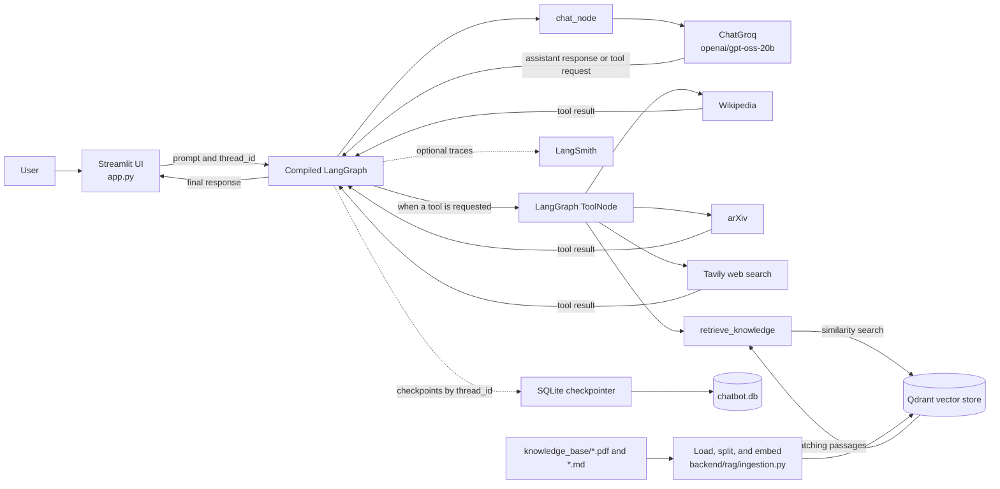

# AgenticOps

AgenticOps is a conversational research assistant built with Streamlit and LangGraph. It streams answers from a Groq-hosted language model, can call research and web-search tools, and can retrieve relevant passages from a local knowledge base. LangGraph checkpoints each conversation to SQLite so it can be resumed by its thread ID.

## What it does

- Streams assistant responses in a Streamlit chat interface.
- Keeps conversations isolated by thread and stores graph state in `chatbot.db`.
- Lets the model choose among Wikipedia, arXiv, Tavily web search, and knowledge-base retrieval tools.
- Uses Qdrant for vector search, with a local on-disk store by default or a configured Qdrant URL.
- Can send execution traces to LangSmith when tracing is enabled.

## Architecture



For each message, the graph calls the model. If the model requests a tool, LangGraph routes the request to `ToolNode`, adds the tool result to the message state, and calls the model again. This loop can repeat until the model returns a final answer. If no tool is requested, the graph returns the answer to Streamlit.

The conversation checkpointer and the knowledge base serve different purposes: SQLite stores conversation state, while Qdrant stores searchable document chunks.

## Quick start

### Requirements

- Python 3.13 or newer
- [uv](https://docs.astral.sh/uv/)
- A Groq API key
- A Tavily API key (the Tavily tool is initialized when the backend loads)

Use `uv sync` to install the complete application dependency set recorded in `pyproject.toml` and `uv.lock`. `requirements.txt` does not include all of the app's runtime dependencies.

### Install and configure

```bash
uv sync
```

Set the Groq key in your shell:

```bash
export GROQ_API_KEY="your-groq-api-key"
export TAVILY_API_KEY="your-tavily-api-key"
```

Or put it in a `.env` file at the project root:

```dotenv
GROQ_API_KEY=your-groq-api-key
TAVILY_API_KEY=your-tavily-api-key
```

Start the app from the repository root:

```bash
uv run streamlit run app.py
```

The app opens in your browser. A local `chatbot.db` file is used for LangGraph checkpoints.

## Tools and knowledge base

The model has access to these tools and chooses when to call them:

| Tool | Purpose | Configuration |
| --- | --- | --- |
| Wikipedia | Look up general reference material | No key configured by this app |
| arXiv | Search research papers | No key configured by this app |
| Tavily | Search the web | `TAVILY_API_KEY` is required when the app starts |
| `retrieve_knowledge` | Search indexed local documents | Index documents into Qdrant first |

### Index documents

Place `.pdf` or `.md` files in `knowledge_base/`, then run:

```bash
uv run python -m backend.rag.ingestion
```

The ingestion script reads supported files in that directory, splits them into 500-character chunks with 50-character overlap, creates embeddings with `sentence-transformers/all-MiniLM-L6-v2`, and writes the chunks to the `knowledge_base` Qdrant collection. The embedding model may be downloaded the first time it is needed.

The repository includes [*Remember When It Matters: Proactive Memory Agent for Long-Horizon Agents*](https://arxiv.org/abs/2607.08716v1) as a sample knowledge-base PDF. The paper is listed on arXiv under [CC BY 4.0](https://creativecommons.org/licenses/by/4.0/); retain the paper's attribution and license link if redistributing it.

By default, Qdrant stores data locally under `qdrant_data/`. To use a Qdrant server instead, export `QDRANT_URL` in the shell before starting the app and before indexing. The standalone ingestion command does not load `.env` itself, so a `QDRANT_URL` value stored only in `.env` will not be seen while indexing. The application uses the same configured store for ingestion and retrieval.

The knowledge-retrieval tool expects the collection to exist. Run ingestion before asking the assistant to search your documents.

## Configuration

| Variable | Required | Description |
| --- | --- | --- |
| `GROQ_API_KEY` | Yes | Authenticates the chat model. |
| `TAVILY_API_KEY` | Yes | Authenticates the Tavily tool, which is initialized when the backend loads. |
| `QDRANT_URL` | No | Uses this Qdrant endpoint instead of the local `qdrant_data/` store. |
| `LANGSMITH_TRACING` | No | Set to `true` to enable LangChain/LangGraph tracing. |
| `LANGSMITH_API_KEY` | For LangSmith | Authenticates LangSmith tracing. |
| `LANGSMITH_PROJECT` | No | Sets the LangSmith project name. |

The app also attaches development metadata and Streamlit/development tags to graph runs. Do not commit API keys or other secrets; `.env` is ignored by Git.

## Local and generated files

The `.gitignore` excludes `.env` files, Streamlit secrets, credential/key files, SQLite databases and sidecars, `chatbot.db`, `qdrant_data/`, Python caches, and local notes. These files can contain API credentials, chat history, or indexed document content, so keep them out of commits.

## Conversation state

Each conversation has a `thread_id`. LangGraph uses that ID to load and save the conversation's checkpoints in `chatbot.db`. The same ID resumes its saved state; a different ID starts a separate conversation.

The current list of conversation IDs is held in Streamlit's session state. Checkpoints remain in SQLite across app restarts, but the sidebar list is not rebuilt from the database when a new Streamlit session starts.

## Project layout

```text
.
├── app.py                     # Streamlit interface and conversation selection
├── backend/
│   ├── chatbot.py             # LangGraph workflow, Groq model, SQLite checkpointer
│   ├── tools.py               # Wikipedia, arXiv, Tavily, and RAG tools
│   └── rag/
│       ├── ingestion.py       # Load, split, and index local documents
│       └── vector_store.py    # Embeddings and Qdrant connection
├── docs/drafts/
│   └── chatbot_workflow.excalidraw # Editable draft of the graph sketch
├── experiments/               # Manual scripts that call live services
│   ├── chatbot_smoke.py
│   ├── hitl_resume_experiment.py
│   └── retrieval_inspection.py
├── knowledge_base/            # Source PDFs and Markdown documents
├── notebooks/
│   └── chatbot_workflow.ipynb  # Workflow exploration notebook
├── src/agenticops/             # Installable package and CLI scaffold
├── LICENSE
├── README.md
├── pyproject.toml             # Application metadata and dependencies
├── requirements.txt            # Minimal list; use uv for the full app
└── uv.lock                    # Locked dependency versions
```

The scripts in `experiments/` are manual explorations, not an automated `pytest` suite. They may call Groq or Qdrant, and the HITL experiment prompts for input.

## Implementation notes

- The graph state uses LangGraph's `add_messages` reducer to retain message history as nodes update the state.
- `tools_condition` routes model tool calls through `ToolNode`; tool results return to the chat node for another model turn.
- The UI reads the saved graph state for the selected thread and renders streamed assistant message chunks.
- `chatbot.db` and `qdrant_data/` are local runtime data and are excluded from version control.
