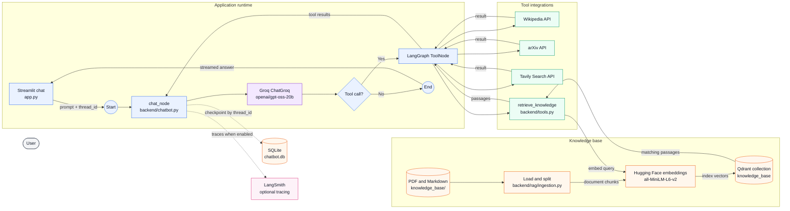

# AgenticOps

AgenticOps is an AI research assistant built with Streamlit and LangGraph. Ask questions in a chat interface and the assistant can use web search, reference sources, academic papers, and your own indexed documents to help answer them.

## Features

- Streamed responses in a conversational Streamlit interface.
- Tool-assisted research with Wikipedia, arXiv, and Tavily web search.
- Retrieval-augmented generation (RAG) over local PDF and Markdown documents, backed by Qdrant.
- Conversation checkpoints stored in SQLite so a conversation can be resumed by its thread ID.
- Optional LangSmith tracing for debugging and observability.

## Architecture

The runtime diagram shows the request path, the model's tool-call loop, and the two persistence systems. A separate ingestion path loads documents into the same Qdrant collection that the retrieval tool searches.



SQLite stores conversation checkpoints keyed by `thread_id`. Qdrant stores embedded document chunks. By default Qdrant persists locally in `qdrant_data/`; it can also connect to a configured Qdrant server.

## Quick start

### Prerequisites

- Python 3.13 or newer
- [uv](https://docs.astral.sh/uv/)
- A [Groq API key](https://console.groq.com/keys)
- A [Tavily API key](https://app.tavily.com/) for web search

### Install

Clone the repository, move into the project directory, and install the locked dependencies. Replace `OWNER` with the GitHub account or organization that hosts the repository:

```bash
git clone https://github.com/OWNER/AgenticOps.git
cd AgenticOps
uv sync
```

Create a `.env` file in the repository root with your API keys:

```dotenv
GROQ_API_KEY=your-groq-api-key
TAVILY_API_KEY=your-tavily-api-key
```

Start the app:

```bash
uv run streamlit run app.py
```

Streamlit opens the chat interface in your browser. The app creates `chatbot.db` in the project directory for conversation checkpoints.

## Use your own documents

Put PDF or Markdown files in `knowledge_base/`, then index them:

```bash
uv run python -m backend.rag.ingestion
```

The ingestion script splits documents into overlapping chunks, creates embeddings with `sentence-transformers/all-MiniLM-L6-v2`, and stores them in the Qdrant `knowledge_base` collection. The embedding model is downloaded the first time it is used. The repository includes [*Remember When It Matters: Proactive Memory Agent for Long-Horizon Agents*](https://arxiv.org/abs/2607.08716v1) as a sample paper. It is distributed under [CC BY 4.0](https://creativecommons.org/licenses/by/4.0/); preserve its attribution and license when redistributing the paper.

The app uses local Qdrant storage in `qdrant_data/` by default. To use a Qdrant server, set `QDRANT_URL` in the shell before indexing and before starting the app:

```bash
export QDRANT_URL="https://your-qdrant-endpoint"
uv run python -m backend.rag.ingestion
uv run streamlit run app.py
```

The standalone ingestion command reads `QDRANT_URL` from the process environment; it does not load values from `.env`. Run ingestion before asking the assistant to search your documents.

## Configuration

| Variable | Required | Purpose |
| --- | --- | --- |
| `GROQ_API_KEY` | Yes | Authenticates the chat model. |
| `TAVILY_API_KEY` | Yes | Authenticates Tavily web search. |
| `QDRANT_URL` | No | Uses a Qdrant server instead of local `qdrant_data/` storage. |
| `LANGSMITH_TRACING` | No | Set to `true` to enable LangSmith tracing. |
| `LANGSMITH_API_KEY` | For LangSmith | Authenticates LangSmith tracing. |
| `LANGSMITH_PROJECT` | No | Sets the LangSmith project name. |

Keep API keys and other secrets out of commits. `.env`, Streamlit secrets, and local database and vector-store files are ignored by Git.

## Conversations

Each conversation has a `thread_id`. LangGraph uses it to load and save checkpoints in `chatbot.db`, so selecting the same conversation resumes its saved state. The sidebar's conversation list is held in Streamlit session state and is not rebuilt from SQLite after a new session starts.

## Project structure

```text
.
├── app.py                       # Streamlit interface and conversation selection
├── backend/
│   ├── chatbot.py               # LangGraph workflow, Groq model, SQLite checkpointer
│   ├── tools.py                 # Wikipedia, arXiv, Tavily, and document retrieval
│   └── rag/
│       ├── ingestion.py         # Load, split, and index local documents
│       └── vector_store.py      # Embeddings and Qdrant connection
├── knowledge_base/              # Source PDF and Markdown documents
├── experiments/                 # Manual experiments with the workflow and tools
├── notebooks/                   # Workflow exploration notebook
├── docs/drafts/                  # Draft workflow diagram
├── src/agenticops/               # Python package scaffold
├── pyproject.toml                # Project metadata and dependencies
├── uv.lock                       # Locked dependency versions
└── LICENSE
```

The scripts in `experiments/` are manual explorations rather than an automated test suite. Some call external services and may require API keys.

## License

This project is distributed under the MIT License. See [LICENSE](LICENSE) for details.
